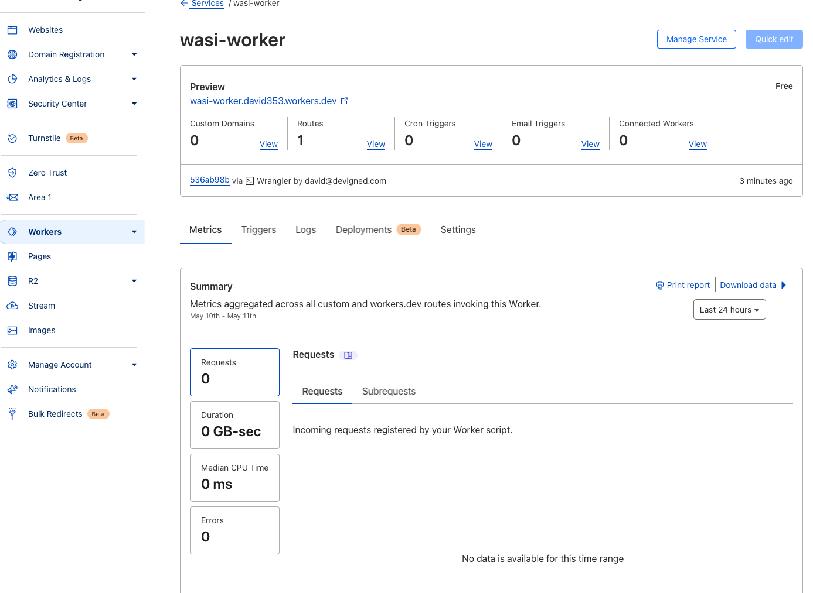

# wasi-worker

Just a super simple illustration of WASI being used locally with Wasmtime and Wrangler, as well as being deployed to CloudFlare.

## Required Tools
- [Cargo](https://rustup.rs)
- [npx](https://docs.npmjs.com/downloading-and-installing-node-js-and-npm)
- [wasmtime](https://docs.wasmtime.dev/cli-install.html)
- make

## What Can the Makefile Do?
```shell
$ make

Usage:
  make <target>
  build                      Build the WASI worker module
  run-cf                     Run the WASI worker module with CloudFlare Wrangler
  run-wt                     Run the WASI worker module with Wasmtime
  publish-cf                 Publish the WASI worker module to CloudFlare
  help                       Display this help.
```

## Instructions for Running with Wasmtime

Before you begin, you need to make sure you have the `wasm32-wasi` target installed. To do this, run the following:
```shell
$ rustup target add wasm32-wasi
```

To run the WASI worker using Wasmtime, run the following:
```shell
$ make run-wt
```
You should see `hello world!` output from the worker.

The preceding command will build the Rust worker project, then run wasmtime. If you are curious, take a look at the Makefile.

## Instructions for Running with CloudFlare's Wrangler
To run the WASI worker using CloudFlare's Wrangler, run the following:
```shell
$ make run-cf
```
You should see something like the following output.
```shell
$ make run-cf
cargo build --target wasm32-wasi --release
    Finished release [optimized] target(s) in 0.00s
npx wrangler@wasm dev target/wasm32-wasi/release/worker.wasm
 ⛅️ wrangler 0.0.0-c0d7699
---------------------------
⬣ Listening at http://localhost:8787
Total Upload: 2228.94 KiB / gzip: 563.45 KiB
```

If you open your browser to the URI above, `http://localhost:8787`, you should see `hello world!`.

## Instructions for Publishing to CloudFlare
To publish your work to CloudFlare, run the following:
```shell
$ make publish-cf
```
You should see something like the following output.
```shell
$ make publish-cf
cargo build --target wasm32-wasi --release
    Finished release [optimized] target(s) in 0.00s
npx wrangler@wasm publish --name wasi-worker --compatibility-date 2023-04-11 target/wasm32-wasi/release/worker.wasm
 ⛅️ wrangler 0.0.0-c0d7699
---------------------------
Total Upload: 2228.94 KiB / gzip: 563.44 KiB
Uploaded wasi-worker (2.84 sec)
Published wasi-worker (3.76 sec)
  wasi-worker.david353.workers.dev
```
If you open your CloudFlare portal, you should see something like the following.

If you click on the `Preview` link, wasi-worker.david353.workers.dev in the preceding image, you will be greeted with the `hello world!` you saw in preceding sections.


